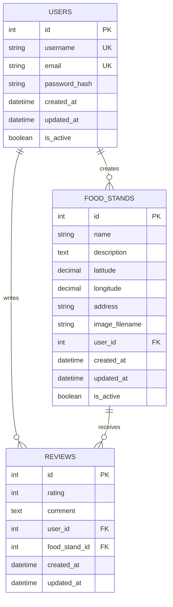
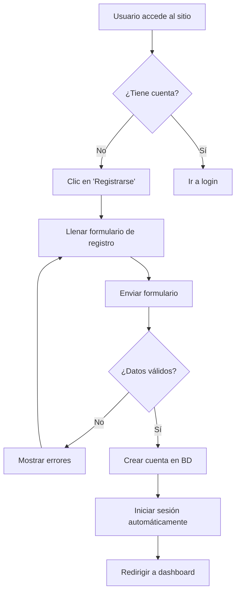
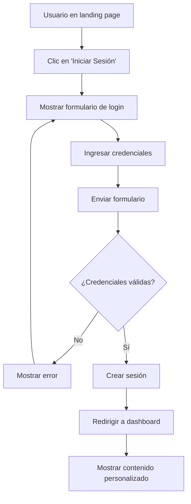
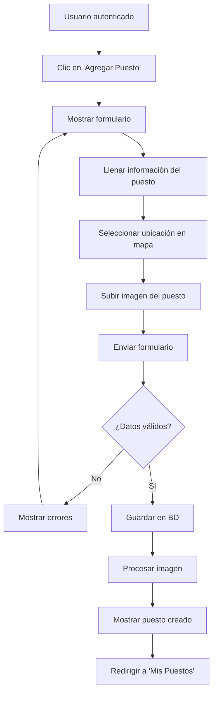
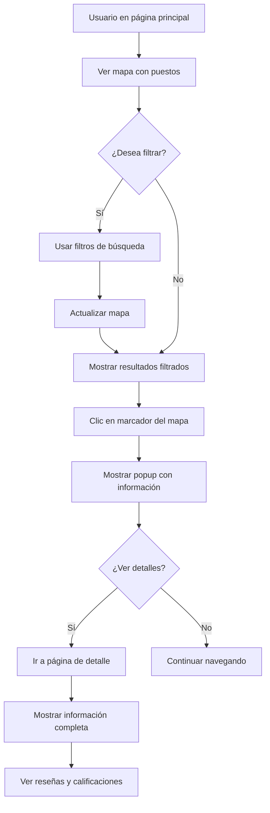
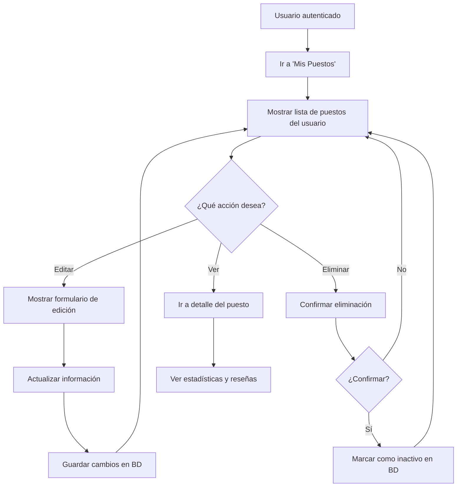

# 📊 Checkpoint 2: Diseño inicial de la base de datos y flujos de usuario

**Fecha de entrega:** [Pendiente]  
**Estado:** ✅ COMPLETADO

---

## 📑 Entregables

### Entregable 1: Esquema entidad-relación de la base de datos ✅

**Descripción:** Esquema entidad-relación de la base de datos que utilizará la aplicación. Este esquema deberá subirse en la plataforma en el apartado indicado, y adicionalmente, se deberá subir al repositorio en una carpeta llamada "documentation/db".

**Estado:** ✅ **COMPLETADO**

**Ubicación:** 
- **Repositorio:** `/documentation/db/` 
- **Plataforma:** [Subir en apartado indicado]

### Entregable 2: Diagramas de flujo de casos de uso ✅

**Descripción:** Diagramas de flujo de los distintos casos de uso que los usuarios podrán ejecutar en la plataforma. Estos diagramas deberán subir al repositorio sin comprimirse en carpeta.

**Estado:** ✅ **COMPLETADO**

**Ubicación:** `/documentation/flowcharts/`

---

## 🗃️ Diseño de Base de Datos

### 📋 **Esquema Entidad-Relación**



### 🔗 **Relaciones**

1. **USERS → FOOD_STANDS** (1:N)
   - Un usuario puede crear múltiples puestos de comida
   - Cada puesto pertenece a un único usuario

2. **USERS → REVIEWS** (1:N)
   - Un usuario puede escribir múltiples reseñas
   - Cada reseña es escrita por un único usuario

3. **FOOD_STANDS → REVIEWS** (1:N)
   - Un puesto puede recibir múltiples reseñas
   - Cada reseña pertenece a un único puesto

### 📊 **Especificaciones de Tablas**

#### 👤 **USERS**
| Campo | Tipo | Restricciones | Descripción |
|-------|------|---------------|-------------|
| id | INTEGER | PRIMARY KEY, AUTO_INCREMENT | Identificador único |
| username | VARCHAR(80) | UNIQUE, NOT NULL | Nombre de usuario |
| email | VARCHAR(120) | UNIQUE, NOT NULL | Correo electrónico |
| password_hash | VARCHAR(255) | NOT NULL | Contraseña hasheada |
| created_at | DATETIME | DEFAULT CURRENT_TIMESTAMP | Fecha de registro |
| updated_at | DATETIME | DEFAULT CURRENT_TIMESTAMP | Última actualización |
| is_active | BOOLEAN | DEFAULT TRUE | Usuario activo |

#### 🏪 **FOOD_STANDS**
| Campo | Tipo | Restricciones | Descripción |
|-------|------|---------------|-------------|
| id | INTEGER | PRIMARY KEY, AUTO_INCREMENT | Identificador único |
| name | VARCHAR(100) | NOT NULL | Nombre del puesto |
| description | TEXT | | Descripción del puesto |
| latitude | DECIMAL(10,8) | NOT NULL | Coordenada latitud |
| longitude | DECIMAL(11,8) | NOT NULL | Coordenada longitud |
| address | VARCHAR(200) | | Dirección física |
| image_filename | VARCHAR(100) | | Nombre del archivo de imagen |
| user_id | INTEGER | FOREIGN KEY, NOT NULL | Propietario del puesto |
| created_at | DATETIME | DEFAULT CURRENT_TIMESTAMP | Fecha de creación |
| updated_at | DATETIME | DEFAULT CURRENT_TIMESTAMP | Última actualización |
| is_active | BOOLEAN | DEFAULT TRUE | Puesto activo |

#### ⭐ **REVIEWS**
| Campo | Tipo | Restricciones | Descripción |
|-------|------|---------------|-------------|
| id | INTEGER | PRIMARY KEY, AUTO_INCREMENT | Identificador único |
| rating | INTEGER | NOT NULL, CHECK (1-5) | Calificación 1-5 estrellas |
| comment | TEXT | | Comentario de la reseña |
| user_id | INTEGER | FOREIGN KEY, NOT NULL | Autor de la reseña |
| food_stand_id | INTEGER | FOREIGN KEY, NOT NULL | Puesto reseñado |
| created_at | DATETIME | DEFAULT CURRENT_TIMESTAMP | Fecha de creación |
| updated_at | DATETIME | DEFAULT CURRENT_TIMESTAMP | Última actualización |

---

## 🔄 Diagramas de Flujo de Casos de Uso

### 1. **Flujo de Registro de Usuario**



### 2. **Flujo de Inicio de Sesión**



### 3. **Flujo de Creación de Puesto**



### 4. **Flujo de Búsqueda y Visualización**



### 5. **Flujo de Creación de Reseña**

```mermaid
flowchart TD
    A[Usuario en detalle de puesto] --> B{¿Está autenticado?}
    B -->|No| C[Mostrar botón de login]
    C --> D[Redirigir a login]
    B -->|Sí| E{¿Es dueño del puesto?}
    E -->|Sí| F[No puede reseñar su propio puesto]
    E -->|No| G[Mostrar formulario de reseña]
    G --> H[Seleccionar calificación (1-5)]
    H --> I[Escribir comentario opcional]
    I --> J[Enviar reseña]
    J --> K{¿Datos válidos?}
    K -->|No| L[Mostrar errores] --> G
    K -->|Sí| M[Guardar reseña en BD]
    M --> N[Actualizar promedio de calificación]
    N --> O[Mostrar reseña en la página]
    O --> P[Actualizar estadísticas del puesto]
```

### 6. **Flujo de Gestión de Puestos del Usuario**



---

## 🎯 **Casos de Uso Principales**

### 👤 **Gestión de Usuarios**
1. **Registro de usuario** - Crear nueva cuenta
2. **Inicio de sesión** - Autenticación de usuario
3. **Cierre de sesión** - Terminar sesión
4. **Recuperación de contraseña** - (Futuro)

### 🏪 **Gestión de Puestos de Comida**
1. **Crear puesto** - Agregar nuevo puesto con ubicación
2. **Ver puestos** - Visualizar en mapa y lista
3. **Editar puesto** - Modificar información propia
4. **Eliminar puesto** - Desactivar puesto propio
5. **Buscar puestos** - Filtrar por criterios

### ⭐ **Sistema de Reseñas**
1. **Escribir reseña** - Calificar y comentar
2. **Ver reseñas** - Leer opiniones de otros usuarios
3. **Calcular promedio** - Mostrar calificación general

### 🗺️ **Navegación y Búsqueda**
1. **Ver mapa interactivo** - Explorar puestos cercanos
2. **Usar geolocalización** - Encontrar puestos cerca
3. **Filtrar resultados** - Búsqueda avanzada
4. **Ver detalles** - Información completa del puesto

---

## 🏆 **Validación de Entregables**

### ✅ Entregable 1 - Esquema ER
- [x] Diagrama entidad-relación completo
- [x] Especificación de todas las tablas
- [x] Definición de relaciones y constraints
- [x] Documentación técnica detallada
- [x] Ubicación en `/documentation/db/`

### ✅ Entregable 2 - Diagramas de Flujo
- [x] Flujo de registro de usuario
- [x] Flujo de inicio de sesión
- [x] Flujo de creación de puesto
- [x] Flujo de búsqueda y visualización
- [x] Flujo de creación de reseña
- [x] Flujo de gestión de puestos
- [x] Ubicación en `/documentation/flowcharts/`

---

## 🏆 **Conclusión del Checkpoint 2**

El **Checkpoint 2** ha sido completado exitosamente con un diseño robusto de base de datos y flujos de usuario bien definidos. El proyecto **QUADRA** cuenta con:

- ✅ **Esquema de BD normalizado** con relaciones bien definidas
- ✅ **Diagramas de flujo completos** para todos los casos de uso
- ✅ **Documentación técnica detallada** para facilitar el desarrollo
- ✅ **Base de datos implementada** y funcionando en PostgreSQL

**Próximo paso:** Checkpoint 3 - Desarrollo de landing page, login y sign up

---

*Actualizado: 11 de agosto de 2025*
