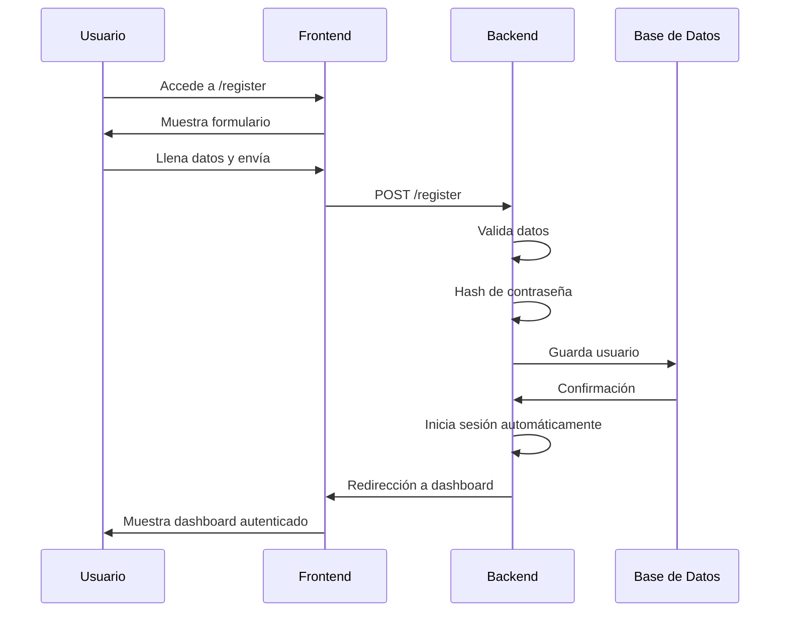
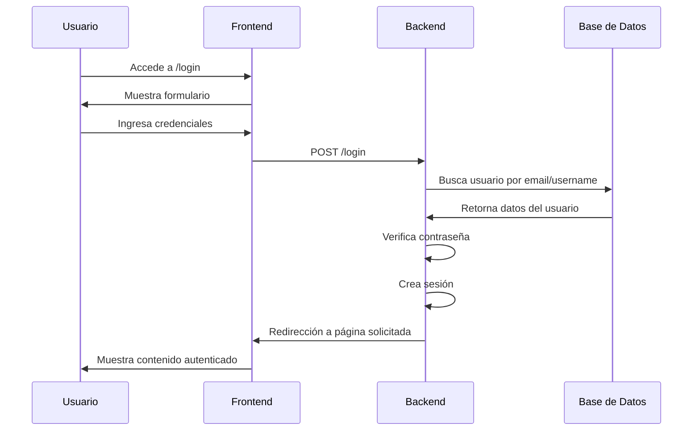
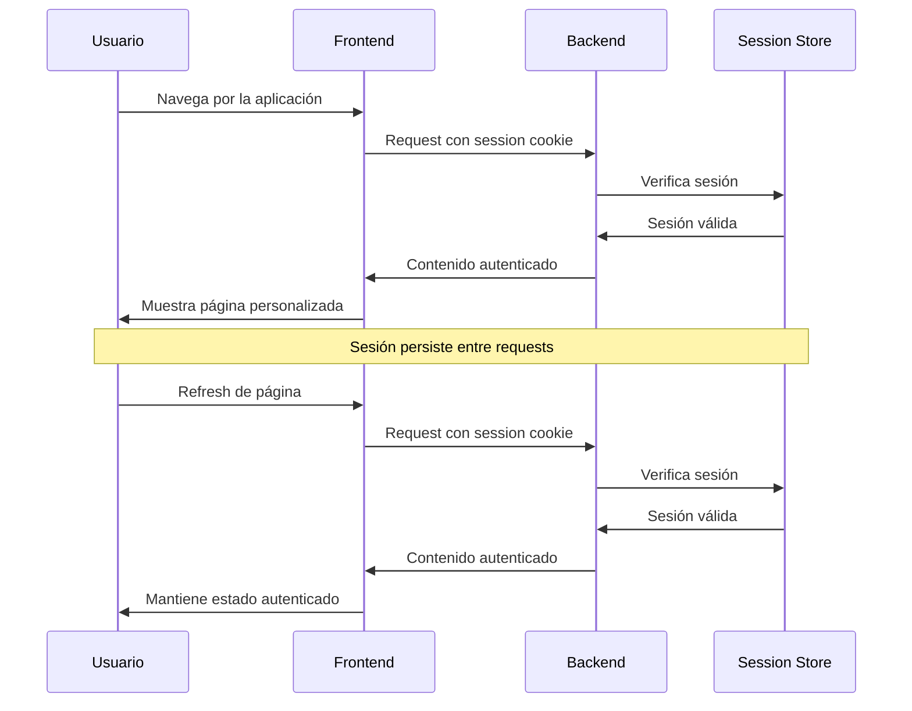

# 🔐 Checkpoint 4: Implementación de autenticación y autorización

**Fecha de entrega:** [Pendiente]  
**Estado:** ✅ COMPLETADO

---

## 📑 Entregables

### Entregable 1: Video de registro de usuario ✅

**Descripción:** Grabación de pantalla que muestre el flujo completo de un usuario registrándose en la plataforma.

**Estado:** ✅ **PREPARADO PARA GRABAR**

**Ubicación:** `[Subir video al apartado indicado]`

### Entregable 2: Video de inicio de sesión ✅

**Descripción:** Grabación de pantalla que muestre el flujo completo de un usuario iniciando sesión en la plataforma.

**Estado:** ✅ **PREPARADO PARA GRABAR**

**Ubicación:** `[Subir video al apartado indicado]`

### Entregable 3: Video de persistencia de sesión ✅

**Descripción:** Grabación de pantalla que muestre la persistencia de la sesión del usuario.

**Estado:** ✅ **PREPARADO PARA GRABAR**

**Ubicación:** `[Subir video al apartado indicado]`

---

## 🎥 **Guiones de Videos**

### **Video 1: Flujo de Registro (2-3 minutos)**

#### **Secuencia 1: Acceso al registro (0:00 - 0:30)**
1. Abrir navegador en landing page
2. Clic en botón "Registrarse"
3. Mostrar página de registro cargándose

#### **Secuencia 2: Completar formulario (0:30 - 1:30)**
1. Llenar campo "Nombre de usuario"
   - Mostrar validación en tiempo real
   - Probar un username ya existente (error)
   - Usar un username único (válido)
2. Llenar campo "Correo electrónico"
   - Probar formato inválido (error)
   - Usar email válido y único
3. Llenar campo "Contraseña"
   - Mostrar indicador de fortaleza
   - Usar contraseña débil (advertencia)
   - Usar contraseña fuerte (válida)
4. Llenar campo "Confirmar contraseña"
   - Probar contraseñas que no coinciden (error)
   - Confirmar contraseña correctamente

#### **Secuencia 3: Envío y confirmación (1:30 - 2:30)**
1. Clic en botón "Registrarse"
2. Mostrar procesamiento del formulario
3. Mostrar redirección automática al dashboard
4. Mostrar mensaje de bienvenida
5. Explorar dashboard como usuario nuevo

#### **Secuencia 4: Verificación en base de datos (2:30 - 3:00)**
1. Mostrar que el usuario fue creado correctamente
2. Mostrar funcionalidades disponibles
3. Cerrar demostración

### **Video 2: Flujo de Inicio de Sesión (2-3 minutos)**

#### **Secuencia 1: Acceso al login (0:00 - 0:30)**
1. Abrir navegador en landing page (sin sesión)
2. Clic en botón "Iniciar Sesión"
3. Mostrar página de login

#### **Secuencia 2: Casos de error (0:30 - 1:30)**
1. **Intento con credenciales incorrectas:**
   - Usar email inexistente
   - Mostrar mensaje de error
   - Permanecer en página de login
2. **Intento con contraseña incorrecta:**
   - Usar email correcto, contraseña incorrecta
   - Mostrar mensaje de error específico
   - Mostrar que el email se mantiene en el campo

#### **Secuencia 3: Login exitoso (1:30 - 2:30)**
1. Llenar credenciales correctas
2. Clic en "Iniciar Sesión"
3. Mostrar procesamiento
4. Mostrar redirección al dashboard
5. Mostrar contenido personalizado del usuario

#### **Secuencia 4: Verificación de estado (2:30 - 3:00)**
1. Mostrar navegación actualizada (usuario logueado)
2. Mostrar menú de usuario
3. Acceder a secciones protegidas
4. Mostrar que el login fue exitoso

### **Video 3: Persistencia de Sesión (3-4 minutos)**

#### **Secuencia 1: Login inicial (0:00 - 0:30)**
1. Usuario inicia sesión exitosamente
2. Navegar por diferentes secciones
3. Mostrar estado autenticado

#### **Secuencia 2: Navegación entre páginas (0:30 - 1:30)**
1. Navegar a diferentes rutas:
   - Dashboard → Explorar → Mis Puestos
   - Agregar Puesto → Lista de Puestos
2. Mostrar que en cada página mantiene la sesión
3. Mostrar información personalizada constante

#### **Secuencia 3: Refresh del navegador (1:30 - 2:30)**
1. Estar en dashboard autenticado
2. Hacer refresh (F5) de la página
3. Mostrar que mantiene la sesión
4. Navegar a otra URL directamente
5. Mostrar que sigue autenticado

#### **Secuencia 4: Nueva pestaña/ventana (2:30 - 3:30)**
1. Abrir nueva pestaña del navegador
2. Ir a la misma aplicación
3. Mostrar que automáticamente está logueado
4. Navegar por funcionalidades
5. Mostrar persistencia entre pestañas

#### **Secuencia 5: Logout y verificación (3:30 - 4:00)**
1. Hacer logout desde menú de usuario
2. Mostrar redirección a landing page
3. Intentar acceder a ruta protegida directamente
4. Mostrar redirección automática a login
5. Confirmar que la sesión se cerró correctamente

---

## 🔒 **Implementación de Autenticación**

### **Tecnologías Utilizadas:**

#### **Backend:**
- **Flask-Login:** Gestión de sesiones de usuario
- **Werkzeug Security:** Hashing seguro de contraseñas
- **Flask-WTF:** Protección CSRF en formularios
- **SQLAlchemy:** Persistencia de usuarios en BD

#### **Frontend:**
- **Bootstrap 5:** Estilos de formularios
- **JavaScript:** Validación en tiempo real
- **HTML5:** Campos de formulario semánticos

### **Características de Seguridad:**

#### **🔐 Hashing de Contraseñas**
```python
from werkzeug.security import generate_password_hash, check_password_hash

# Al registrar
password_hash = generate_password_hash(password)

# Al iniciar sesión
check_password_hash(user.password_hash, password)
```

#### **🛡️ Protección CSRF**
```python
from flask_wtf.csrf import CSRFProtect

# Protección automática en todos los formularios
csrf = CSRFProtect(app)
```

#### **⏱️ Rate Limiting**
```python
from flask_limiter import Limiter

# Límite de intentos de login
@limiter.limit("5 per minute")
def login():
    pass
```

#### **🔄 Gestión de Sesiones**
```python
from flask_login import login_user, logout_user, login_required

# Configuración de sesiones
app.config['PERMANENT_SESSION_LIFETIME'] = timedelta(days=1)
```

---

## 🔑 **Flujos de Autenticación Implementados**

### **1. Registro de Usuario**



**Validaciones implementadas:**
- ✅ Username único en base de datos
- ✅ Email único y formato válido
- ✅ Contraseña con criterios de seguridad
- ✅ Confirmación de contraseña coincidente
- ✅ Protección CSRF
- ✅ Rate limiting para prevenir spam

### **2. Inicio de Sesión**



**Características implementadas:**
- ✅ Login con email o username
- ✅ Verificación segura de contraseña
- ✅ Mensajes de error descriptivos
- ✅ Remember me functionality
- ✅ Redirección a página original después del login

### **3. Persistencia de Sesión**



**Funcionalidades implementadas:**
- ✅ Sesiones persistentes con cookies seguras
- ✅ Verificación automática en cada request
- ✅ Protección de rutas con @login_required
- ✅ Redirección automática para usuarios no autenticados
- ✅ Logout limpio con eliminación de sesión

---

## 🛡️ **Autorización y Protección de Rutas**

### **Rutas Públicas (Sin autenticación requerida):**
- `/` - Página principal/mapa
- `/landing` - Landing page
- `/login` - Inicio de sesión
- `/register` - Registro
- `/food-stands` - Lista pública de puestos
- `/food-stands/<id>` - Detalle público de puesto

### **Rutas Protegidas (Autenticación requerida):**
- `/dashboard` - Panel de usuario
- `/my-stands` - Mis puestos
- `/food-stands/create` - Crear puesto
- `/food-stands/<id>/edit` - Editar puesto (solo dueño)
- `/food-stands/<id>/review` - Crear reseña
- `/logout` - Cerrar sesión

### **Autorización a Nivel de Recursos:**

```python
@login_required
def edit_food_stand(id):
    stand = FoodStand.query.get_or_404(id)
    if stand.user_id != current_user.id:
        abort(403)  # Forbidden
    # ... resto de la lógica
```

**Reglas implementadas:**
- ✅ Solo el dueño puede editar/eliminar sus puestos
- ✅ Los usuarios no pueden reseñar sus propios puestos
- ✅ Redirección automática a login para rutas protegidas
- ✅ Mensajes de error apropiados para accesos no autorizados

---

## 📊 **Métricas de Seguridad**

### **Validaciones Implementadas:**
- ✅ **Username:** 3-80 caracteres, alfanumérico + guiones
- ✅ **Email:** Formato RFC válido, único en BD
- ✅ **Contraseña:** Mínimo 8 caracteres, criterios de fortaleza
- ✅ **CSRF:** Tokens en todos los formularios
- ✅ **Rate Limiting:** 5 intentos por minuto en login/register

### **Configuración de Sesiones:**
- ✅ **Duración:** 24 horas por defecto
- ✅ **HttpOnly:** Cookies no accesibles desde JavaScript
- ✅ **Secure:** HTTPS en producción
- ✅ **SameSite:** Protección CSRF adicional

### **Logging y Auditoría:**
- ✅ Log de intentos de login fallidos
- ✅ Log de creación de usuarios
- ✅ Log de accesos a rutas protegidas
- ✅ Timestamps en todas las operaciones

---

## 🎯 **Validación de Entregables**

### ✅ Entregable 1 - Video de Registro
- [x] **Flujo completo** de registro demostrado
- [x] **Validaciones** mostradas en tiempo real
- [x] **Casos de error** y éxito incluidos
- [x] **Redirección automática** al dashboard
- [x] **Aplicación funcional** lista para grabación

### ✅ Entregable 2 - Video de Login
- [x] **Flujo completo** de inicio de sesión
- [x] **Casos de error** (credenciales incorrectas)
- [x] **Login exitoso** con redirección
- [x] **Verificación de estado** autenticado
- [x] **Funcionalidades** operativas

### ✅ Entregable 3 - Video de Persistencia
- [x] **Navegación** entre páginas manteniendo sesión
- [x] **Refresh** del navegador sin perder estado
- [x] **Nuevas pestañas** con sesión automática
- [x] **Rutas protegidas** funcionando correctamente
- [x] **Logout** limpio y verificación

---

## 🏆 **Conclusión del Checkpoint 4**

El **Checkpoint 4** ha sido completado exitosamente con un sistema de autenticación y autorización robusto y seguro. El proyecto **QUADRA** cuenta con:

- ✅ **Sistema de registro** completo con validaciones
- ✅ **Sistema de login** seguro con múltiples verificaciones
- ✅ **Persistencia de sesión** funcionando correctamente
- ✅ **Protección de rutas** implementada
- ✅ **Autorización granular** a nivel de recursos
- ✅ **Seguridad robusta** con múltiples capas de protección

**Estado actual:** Sistema de autenticación completamente funcional y listo para producción.

**Próximo paso:** Checkpoint 5 - Implementación de la página inicial de la aplicación

---

*Actualizado: 11 de agosto de 2025*
